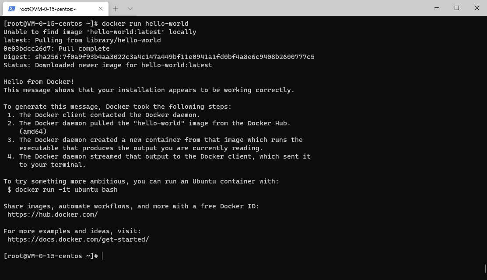

## Install Docker

---

### 下载Docaker的依赖环境

```sh
$ yum -y install yum-utils device-mapper-persistent-data lvm2
```

* `yum-utils` 软件包，提供 `yum-config-manager` 实用程序，并且设置稳定的储存库
* `device-mapper-persistent-data` 是 `Device Mapper` 的驱动程序
* `lvm2` 是基于 `Device Mapper` 机制实现的逻辑卷管理器

`lvm2` 在硬盘和分区之上建立一个逻辑层，可以将诺干个磁盘分区链接为一个整块的卷组(Volume Group)，形成一个储存池。可以在卷组上随意的创建逻辑卷(Logical Volumes)，并进一步在逻辑卷上创建文件系统，与直接使用武力储存管理相比，可以提供更好的灵活性

### 修改Docker镜像源

```sh
$ yum-config-manager --add-repo http://mirrors.aliyun.com/docker-ce/linux/centos/docker-ce.repo
```

emmm... 因为墙的原因都推荐阿里镜像源

### 安装Docker引擎

```sh
yum makacache fast
yum -y install docker-ce
```

### 启动Docker服务

```sh
$ systemctl start docker
```

### 设置开机自动启动

```sh
$ systemctl enable docker
```

### 测试Docker

```sh
$ docker run hello-world
```



安装成功