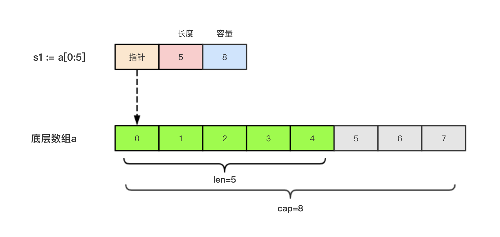
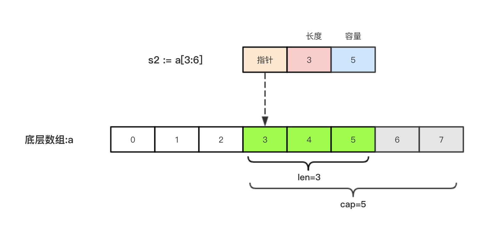

## Slice (切片)

---

在Go语言中，因为 array数组的长度是固定的，而且数组长度属于类型的一部分，所以在实际运用当中，数组有很多的局限性

slice 是一个轻量级的数据结构，提供了访问数组子序列(或者全部)元素的功能，而且 slice 的底层是引用一个 array数组 对象

Slice是一个引用类型，他的内部结构包含 `地址指针`、`长度len()`、`容量cup()`

1. 地址指针：指向 slice 中第一个元素对应的底层数组元素的地址
2. 长度len()：对应 slice 中元素的个数，长度不能超过容量cup()
3. 容量cup()：对应 slice 中第一个元素在底层数组的位置到底层数组结尾的位置

**注意：** slice的第一个元素不一定是底层数组的第一个元素，而且多个 slice 可以共享底层数组

### 切片的定义

```go
var 切片名称 []T
```

```go
var a []string              // 声明一个string切片
var b = []int{}             // 声明一个int切片并初始化
var c = []bool{false,true}  // 声明一个bool切片并初始化

fmt.Println(a)              // []
fmt.Println(b)              // []
fmt.Println(c)              // [false,true]

fmt.Println(a == nil)       // true
fmt.Println(b == nil)       // false
fmt.Println(c == nil)       // false
```

**注意：** slice 和 array不同，slice之间不能比较，slice 唯一合法的比较操作是和 `nil` 比较

### 切片的长度和容量

Slice 拥有自己的长度和容量，可以使用内置 `len()` 函数求 slice 的长度，使用内置 `cap()` 函数求 slice 的容量

### 切片的表达式

切片表达式是从 string、array、指向 array 或 slice 的指针构造子 string 或 slice。

1. 指定 start 和 end 两个索引界限值来构造 Slice
2. 指定 start end 和 cup 的完整形式来构造 Slice

#### 简写切片表达式

Go语言中，slice 的底层就是一个 array，所以我们可以基于 array 通过切片表达式得到 slice。在切片表达式中索引 `start` `end` 表示一个索引范围 (左开右闭)

```go
var a = [5]int{1,2,3,4,5}
var s = a[1:3]

fmt.Printf("s:%v len:%v cap:%v",s,len(s),cap(s))

/* 输出：s:[2,3] len:2 cap:4 */
```

1. 如果 start 省略，默认为从索引 0 开始
2. 如果 end 省略，默认为到 len()-1 结束

```go
a[1:]           // 等价于 a[1:len(a)]
a[:3]           // 等价于 a[0:3]
a[:]            // 等价于 a[0:len(a)]
```

**注意：** 切片的取值范围为 `0<=start<=end<=cap(a)`否则会索引越界(out of range)

#### 完整切片表达式

对于 array 指向 array 的指针，或者 slice 支持完整切片表达式(string不支持)

```go
a[start:end:capLen]
```

1. start: 开始索引，最小值为 0
2. end: 结束索引，最大值为cap(a)
3. capLen: 子slice 的`cap = capLen-start` 最大值可设为 cap(a)

```go
var a = [...]int{1,2,3,4,5}
var t = a[1:3:5]

fmt.Printf("t:%v len(t):%v cap(t):%v",t,len(t),cap(t))

/* 输出：t:[2,3] len(t):2 cap(t):4 */
```

完整切片表达式同样要满足取值范围 `0<=start<=end<=capLen<=cap(a)`

#### 使用 make() 函数构造切片

可以使用Go语言中内建函数 make() 动态的创建一个切片

```go
make([]T,len,cap)
```

1. []T: slice 中元素的类型
2. len：slice 中元素的个数
3. cap：slice 的容量

```go
var a = make([]int,2,10)
fmt.Printf("a:%v len(a):%v cap(a):%v",a,len(a),cap(a))

/* 输出：a:[0,0] len(a):2 cap(a):10 */
```

slice a 的容量为10，但实际上只用了2个，容量不会影响当前元素的个数，多余的容量是留给未来增长用的，如果在 make() 函数中省略 cap 参数，则 cap = len

```go
var a = make([]int,2)

fmt.Printf("a:%v len(a):%v cap(a):%v",a,len(a),cap(a))

/* 输出：a:[0,0] len(a):2 cap(a):2 */
```

在底层，make() 创建了一个匿名的 array 变量，然后返回一个 slice，只有通过返回的 slice 才能引用底层匿名的 array 变量

#### 切片的本质

```go
var a = [8]int{0,1,2,3,4,5,6,7}
s1 := a[:5]
```



```go
var a = [8]int{0,1,2,3,4,5,6,7}
s2 := a[3:6]
```



#### 判断 slice 是否为空

需要检查 slice 是否为空，需要使用 `len(slice) == 0` 来判断，而不能使用 `slice == nil` 来判断。因为一个 nil 值的 slice 长度和容量都为 0，但是也有不是 nil 值的 slice 长度和容量也为 0 的

```go
var a []int             // len == 0 cap == 0 a == nil
var b = []int{}         // len == 0 cap == 0 b != nil
var c = make([]int,0)   // len == 0 cap == 0 b != nil  
```

### slice 不能直接相互比较

slice 和 array 不同，slice 之间是不能相互比较的，slice 唯一合法的比较操作是和 `nil` 比较

一个 `nil` 值的 slice 并没有底层 array，相当于只声明了类型，但是并没有初始化

所以要判断一个 slice 是否为空，使用 `len(slice) == 0`

如果要判断两个 slice 是否一样时，标准库提供了高度优化的 **bytes.Equal函数** 来判断两个 字节型slice([]byte) 是否相等，但是对于其他类型的slice，必须展开每个元素进行比较

```go
func equal(x,y []int) bool {
    if len(x) != len(y) {
        return false
    }
    for i := range x{
        if x[i] != y[i] {
            return false
        }
    }
    return true
}
```

### slice 的赋值拷贝

slice 属于引用数据类型，如果两个 slice 引用同一个底层 array 时，对一个 slice 修改 会影响到另一个 slice 的内容

```go
var a = make([]int,3)   // [0 0 0]
var b = a               // 将a直接复制给b，a和b共同引用同一个 array

a[0] = 100

fmt.Println(a)          // [100 0 0]
fmt.Println(b)          // [100 0 0]
```

### slice 遍历

slice 遍历的方法和 array 一致，使用 `for` 循环语句

```go
var a = []{1,2,3,4,5,6,7}

for i := 0; i < len(a)-1; i++ {
    fmt.Println(a[i])
}

/* *********************** */

for _, v := range a{
    fmt.Println(v)
}
```

