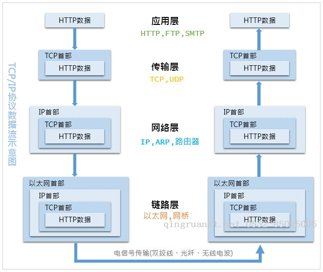

## 网络协议

---

互联网的核心是一系列协议，总称为 “互联网协议” (Internet Protocol Suite)，正是这一系列协议规定了电脑如何连接和组网。

### OSI分层模型

OSI是一个开放性的通信系统互联参考模型，在OSI模型中，总共分为7层，从上到下依次为：7应用层、6表示层、5会话层、4传输层、3网络层、2数据链路层、1物理层

越往上的层越靠近用户，越往下的层越靠近硬件

而在实际的软件开发中，我们常使用5层模型：5应用层、4传输层、3网络层、2数据链路层、1物理层

#### 物理层

字面意思，就是连接设备使用的物理介质，如：光纤、网线、wifi

#### 数据链路层

以太网规定，一组电信号构成一个数据包，叫做 **帧** (Frame)，每一帧分成三个部分：标头 (Head) 数据 (Data) 尾部，其中 **标头** 包含数据包的一些说明，如：发送者、接收者、数据类型等等，**数据** 则是数据包的具体内容，**尾部** 表示数据帧校验序列

1. 标头: 长度固定为 14Byte
2. 数据: 长度最短为 46Byte，最长为1500Byte
3. 尾部: 长度固定 4Byte
 
因此，整个帧最短为64Byte，最长为1518Byte，如果数据包过长，就必须分割成多个帧进行发送

而数据包的接收与发送必须使用地址，而这个地址就被称之为 MAC地址，每块网卡出厂时，都有一个全世界独一无法的 MAC地址，长度是48个二进制位，通常使用12个十六进制数表示，有了MAC地址，就可以定位网卡和数据包的路径

通过ARP协议来获取接收方的MAC地址，在以太网中，数据包并不是直接发送到指定的MAC地址处，而是采用了广播的形式，向网络内的所有计算机都发送，让每台计算机读取这个包的标头，找到接收方的MAC地址，然后与自身的MAC地址相比较，如果相同则接收这个数据包，反之则抛弃这个包

#### 网络层

如果按照以太网协议的规则，完全可以依靠MAC地址来向外发送数据，但是这种做法有一个重大缺陷，就是要以广播的形式发包，导致每台PC都要接收包，在网络刚出现联网PC还不多的时候还行，但是现在全球大量PC联网的情况下，效率实在是底下，而且发送的数据只能局限在发送者所在的子网络，如果两设备不在同一个子网络，广播是没法传播过去的

因此，就需要一种方法，如果在同一个子网络，就采用广播式发送，否则就采用 **路由** 方式发送，这导致了 **网络层** 的诞生，它的作用是引进一套新的地址，能够区分不同的PC是否属于同一个子网络，这地址就叫 **网络地址**

网络层出现之后，每台设备有了两种地址：MAC地址、网络地址，两种地址直接没有任何联系，MAC地址是绑定在网卡上的，而网络地址则是网络管理员分配的，网络地址帮助我们确定设备所在的子网络，MAC地址则将数据包发送到该子网络中目标网卡上

IP协议，则是规定网络地址的协议，所定义的地址，被称之为IP地址，IPv4由32个二进制位组成，常用4断十进制数表示IPv4地址，从0.0.0.0到255.255.255.255

而因为网络的发展，而推出了IPv6,IPv6由128个二进制位组成,长度为IPv4的4倍，有3种表示法：

1. 冒分十六进制表示法: `x:x:x:x:x:x:x:x`，其中每个x表示地址中的16个二进制位，以十六进制表示，在这种表示法中，每个x的前导0是可以省略的
2. 0位压缩表示法: 某些情况下，一个IPv6地址中间可能包含很长一段0，可以把连续的一段0压缩为 `::`，但为保证地址解析的唯一性，地址中 `::` 只能出现一次
3. 内嵌IPv4地址表示法: 为了实现IPv4与IPv6互通，IPv4地址会内嵌入IPv6地址中 `x:x:x:x:x:x:d.d.d.d`，前96个二进制位采用冒分十六进制表示，而最后32个二进制位则使用IPv4点分十进制表示，而且在前96个二进制位中，0位压缩表示法依然可以使用

根据IP协议发送的数据，叫做IP数据包，IP数据包也分为 **标头** 和 **数据** 两个部分

1. 标头: 包含版本、长度、IP地址等信息，长度为20 - 60 Byte
2. 数据: IP数据包的具体内容

整个IP数据包的总长度最大为 65535 Byte

#### 传输层

**端口** (port) 是每一个使用网卡的程序编号，通过端口号，来确定IP数据包的接收应用程序

端口是0 - 65535 之间的一个整数，正好是16个二进制位，0 - 1023 的端口号被系统占用，用户只能选择大于 1023 的端口号

而在数据包中加入端口信息，则需要新的协议，最简单的实现就是 UDP协议，它的格式几乎就是在数据面前，加上端口号，UDP数据包，也是由 **标头** 和 **数据** 两部分组成

1. 标头: 定义发出端口和接收端口，长8 Byte
2. 数据: 就是具体部分

UDP数据包总长不超过 65535 Byte，正好放进一个IP数据包中

UDP协议的优点是简单，容易实现，但缺点是可靠性查，一旦数据包发出，无法知道对方是否收到

TCP协议能够确保数据不会遗失，但是缺点过程复杂，实现困难，消耗较多资源，TCP数据包没有长度限制，理论上可以无限长，但是为了保证网络的效率，通常TCP数据包的长度不会超过IP数据包的长度(65535 Byte)，以确保单个TCP数据包不必再分割

#### 应用层

应用程序收到 传输层 的数据，就要对数据进行解包

应用层的作用就是规定应用程序使用的数据格式，如: Email、HTTP、FTP等协议

