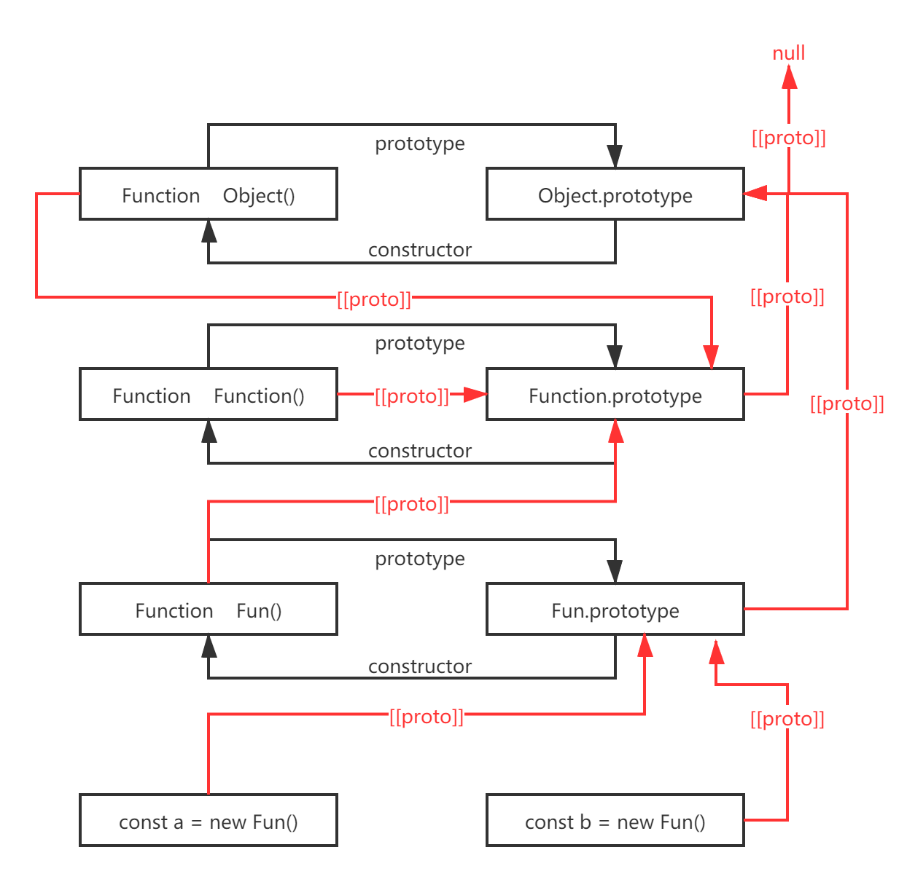

## 原型与原型链

----

创建的每个函数，都有一个 prototype 属性，这个属性是一个指针，指向一个对象(FunctionName.prototype)，**原型对象是Object()的实例**，这对象的的用途就是包含特定类型的所有实例公共的属性和方法，减少每个实例都要写的代码

```javascript
function Person () {}

/* 给 Person.prototype 添加公共方法 */
Person.prototype.sayHi = function () {console.log('hi')}

/* 创建 Person() 的两个实例 */
const a = new Person()
const b = new Person()

/* 调用 实例a & 实例b 的 sayHi 方法 */
/* sayHi() 方法被添加到 构造函数 Person() 的 prototype 上 */
/* 所以 实例a & 实例b 创建的时候，就包含 sayHi() 方法，可以直接调用 */
a.sayHi()               // hi
b.sayHi()               // hi
```

### 原型对象

#### constructor

原型都包含有的属性，它是指向 prototype 所在函数的指针

```javascript
function Person () {}
Person.prototype.sayHi = function () {console.log('hi')}

const a = new Person()
const b = new Person()
console.log(a.say === b.say)        // 返回 true 说明是同一个对象

console.log(Person.prototype.constuctor === Person)
/* 同样是返回 true，说明这两玩意是同一个对象 */
```

#### 其他方法

prototype object 的方法都是从 Object() 继承来的，因为 **所有的 prototype object 都是 Object() 的实例**

#### isPrototypeOf()

用来检测原型是不是实例的原型

```javascript
function Person () {}

const a = new Person()

console.log(Person.prototype.isprototypeOf(a))      // ture
```

#### Object.getPrototypeOf()

用来取__proto__的值

```javascript
function Person () {}
Person.prototype.name = 'OctopusRoe'

const a = new Person()

console.log(Object.getPrototypeOf(a) === Person.prototype)  // true
console.log(Object.getPrototypeOf(a).name)                  // 'OctopusRoe'
```

#### hasOwnProperty()

用于检测属性是存在实例上，还是存在原型上，返回的是 Boolean

```javascript
function Person () {}
Person.prototype.name = 'OctopusRoe'

const a = new Person()
a.age = 18

console.log(a.hasOwnProperty('name'))               // false
/* 属性 'name' 是 Person.prototype 的属性 */

console.log(a.hasOwnProperty('age'))                // true
/* 属性 'age' 是 a 实例 的属性 */
```

### 原型链

所谓的原型链，就是每个**实例**，都有个__proto__属性，指向**实例的构造函数的原型**，嗯有点绕，原型链就是下图的红线，注意 Object.prototype 的__proto__ 属性指向 null，以为 Object.prototype 是顶层
