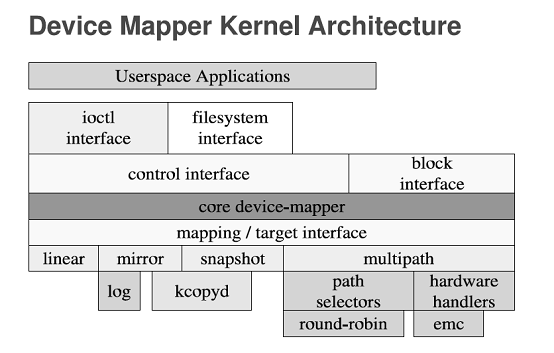

## DeviceMapper 机制

---

Device Mapper 是 Linux2.6 内核中指出逻辑卷管理的通用设备映射机制，它为实现用于存储资源管理的块设备驱动提供了一个高度模块化的内核构架

在内核中它通过一个一个模块化的 target driver 插件实现对 IO 请求的过滤或者重新定向等工作

[Linux 内核中的Device Mapper机制](https://www.ibm.com/developerworks/cn/linux/l-devmapper/index.html)