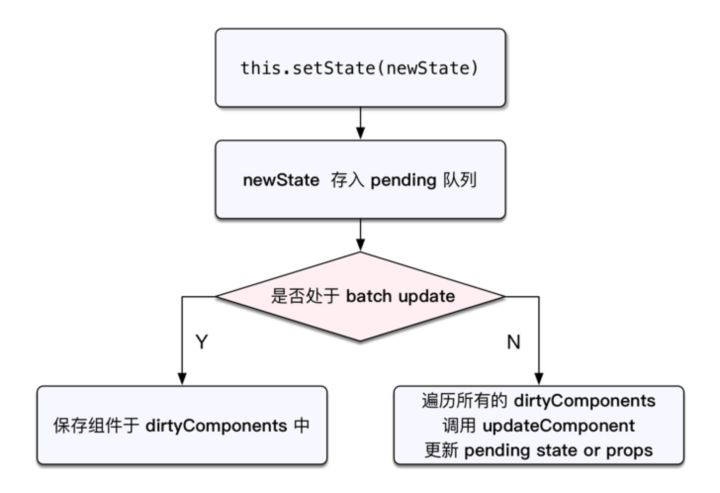

## setState 解析

---

在 React 的 class 组件中，`consttuctor` 构造函数是唯一一个可以初始化 state 的地方，该函数也是 React 组件中的一个钩子函数，最先切只执行一次

如果更新状态的时候使用 `this.state`，值会改变，但是不会触发 React 本身的 `render` 函数

而是应该使用 `this.setState()` 方法来修改，此方法接受两种参数

1. 对象: 想要修改的state内的值
2. 函数: 接收两个函数，第一个函数接收两个参数，其中第一个参数是当前的 `state`，第二个参数是当前的 `props`，该函数应当返回一个对象，与直接传递对象参数是一样的，就是应当要修改的state内的值，第二个函数是当改变state后所触发的回调

在 React 中，调用 `this.setState` 修改 state 值的时候，可能是异步的，也可能是同步的

### 为什么使用 setState 修改值有可能是异步的

当使用 `this.setState` 时，大致的流程是，更新state，创建新的VNode，diff算法对比，判断渲染地方，才最终形成新的UI。要经过4个生命周期函数

1. shouleComponentUpdate
2. componentWillUpdate
3. render
4. componentDidUpdate

当组件的数据依赖于父组件时，还会执行一个 `componentWillReceiveProps` 生命周期函数

如果使用 `this.setState` 是同步更新，会造成性能浪费

注意: 在一个函数中多个 `this.setState` 在执行的时候可能会被合并

### this.setState何时异步何时同步

**由 React 控制的事件处理程序，以及生命周期函数调用 this.setState 不会同步更新 state**

**由 React 控制之外的事件中调用 this.setState 是同步更新，如原生 JavaScript 绑定的事件、setTimeout、setInterval等**

React 控制的事件如: `onChange` `onClick` 等，这些事件处理程序中的 `this.setState` 都是异步的

```javascript
constructor() {
  this.state = {
    count: 10
  }

}

render() {
  return (
    <button onClick={this.hanldeClickOne}>按钮1</button>
    <button id="btn">按钮2</button>
    <button onClick={this.hanldeClickTwo}>按钮3</button>
  )
}

handleClickOne = () => {
  this.setState({ count: this.state.count + 1})
  console.log(this.state.count)
}

componentDidMount = () => {
  document.getElementById('btn').addEventListener('clcik', () => {
    this.setState({ count: this.state.count + 1})
    console.log(this.state.count)
  })
}

handleClickTwo = () => {
  setTimeout(() => {
    this.setState({ count: this.state.count + 1})
    console.log(this.state.count)
  }, 10)  
}
```

按钮1，使用 React 的 `onClick` 事件，输出为 10，由此可以看出该事件处理程序中的setState是异步更新state的。

按钮2，使用原生 JavaScript 的 `addEventListener` 来绑定事件，输出为 11，由此可以看出该事件处理程序中的setState是同步更新state的

按钮3，使用了 JavaScript 的 `setTimeout`，输出同样为 11

按钮2与按钮3的两种方式绕过了 React ，说明在使用 React 无法掌控的 API 的情况下，`this.setState` 是同步更新 state 的

### React如何控制异步和同步

在 React 的 `setState` 函数实现中，会根据一个变量 `isBatchingUpdates` 判断是直接更新 state 还是放到队列中延时更新，而 `isBatchingUpdates` 默认是 false，表示 `setState` 会同步更新 `this.state`；但是，有一个函数 `batchedUpdates`，该函数会把 `isBatchingUpdates` 修改为 true，而当 React 在调用事件处理函数之前就会先调用这个 `batchedUpdates` 将 `isBatchingUpdates` 修改为true，这样由 React 控制的事件处理过程 `setState` 不会同步更新 state



### 多个 this.setState 调用会合并处理

```javascript
render() {
  console.log('render')
}
hanldeClick() {
  this.setState({ name: 'jack' })
  this.setState({ age: 12 })
}
```

在 `hanldeClick` 处理程序中调用了两次 `this.setState`，但是 `render` 函数只执行了一次。因为 React 会将多个 `this.setState` 产生的修改放在一个队列里进行批延时处理

### 在 this.setState 方法中传入函数

```javascript
class Test extends React.Component {
  constructor(props) {
    super(props)
    this.state = {
      one: 0
    }
  }
  render () {
    return (
      <div>
        <h1>one的值为{this.state.one}</h1>
        <button onClick={this.add}>加1</button>
      </div>
    )
  }

  add = () => {
    this.setState(handleClick,backFunc)
    this.setState(handleClick,backFunc)
    this.setState(handleClick,backFunc)
    this.setState(handleClick,backFunc)
  }

  handleClick = (state, props) => ({one: state.one + 1})

  backFunc = () => {
    console.log(this.state.one)
  }
}
```

`handleClick` 函数接收两个参数，参数1: 原来的 state，参数2: 原来的 props

`backFunc` 函数，更新完后 state 的回调函数，如果需要更新完后 state 马上做一些计算，可以放在这个函数中

注意: 在 `add` 函数被调用时， state 并没有被改变，依然要等到 `render` 函数被重新执行时（或者 `shouldComponentUpdate` 函数返回false之后）才被改变，因为 `render` 只执行一次。

总结一下，当 React 的事件中使用 `this.setState` 修改 state 内的值时，会在这个事件执行完毕后统一对比 VNode 对象，然后在合并修改

注意: 在函数式组件中，hook中的setXXX()无论在 React 事件还是原生 JavaScript 事件都是异步更新 state 的